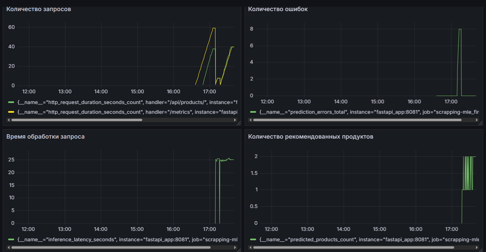

# Дашборд Grafana для сервиса рекомендации продуктов:

## Для мониторинга выбраны метрики нескольких слоев:

### Метрики реального времени:
 - Количество запросов

 - Процент ошибок 

 - Время обработки запроса 

### Метрики прикладного уровня:

 - Количество рекомендованных продуктов.

## Дашборд

